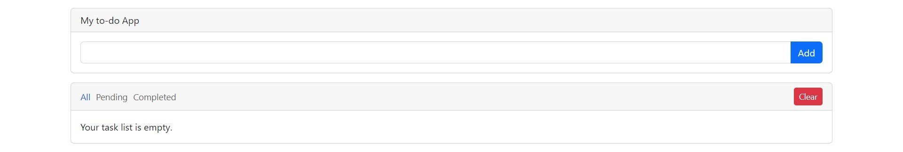

# My to-do App

- This project provides us to form a "To Do List" that we can use it in daily life. 
 
 

- You can do whatever you want on that list. You can add or delete tasks, or edit the existing ones. 

 

 

- Moreover you can mark finished tasks as completed. You can filter your task and observe the pending and completed ones. 

 

 

## Used Technologies

- HTML
- CSS
- JAVASCRIPT